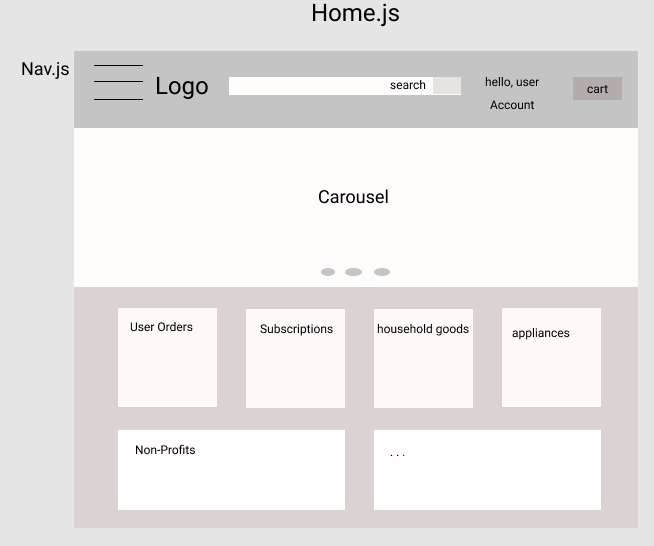
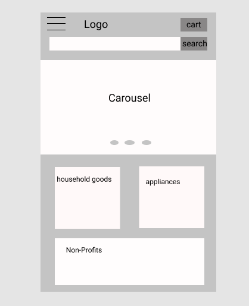
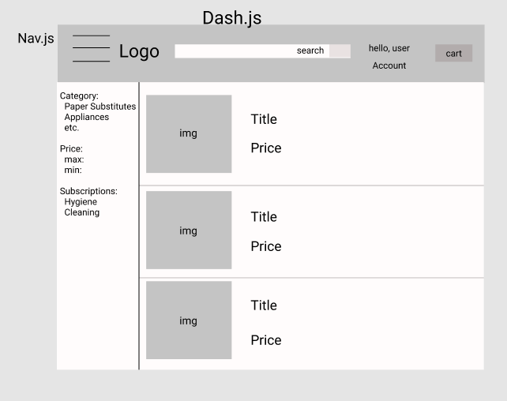
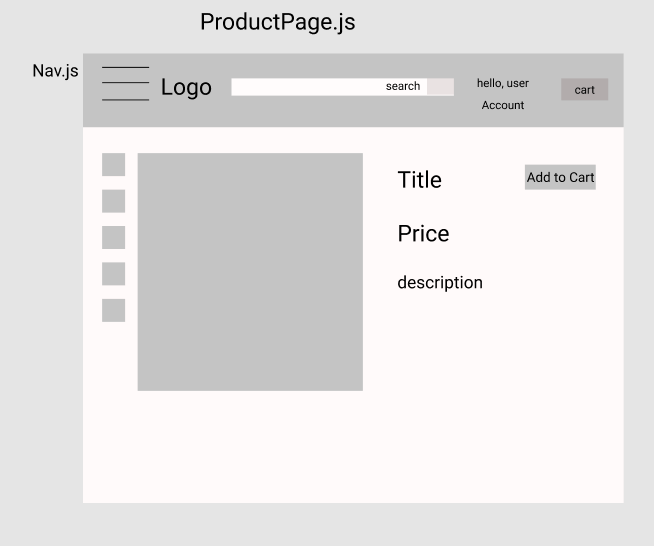
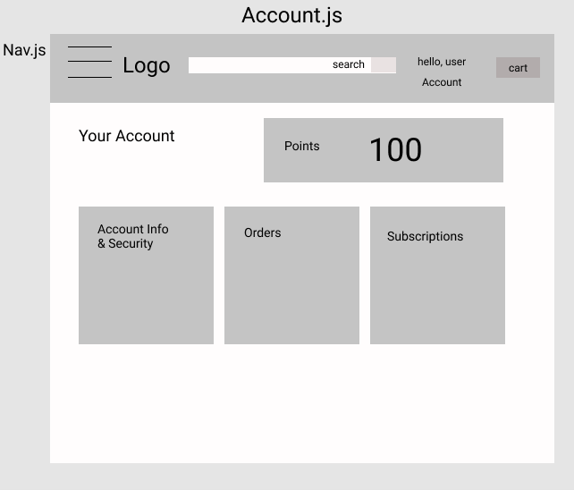
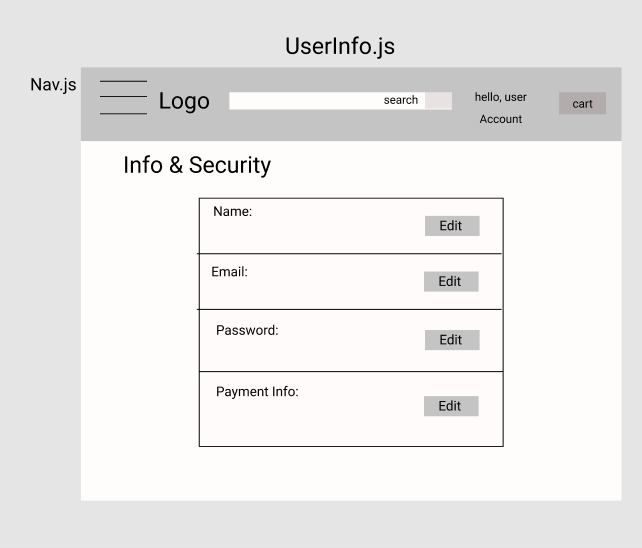
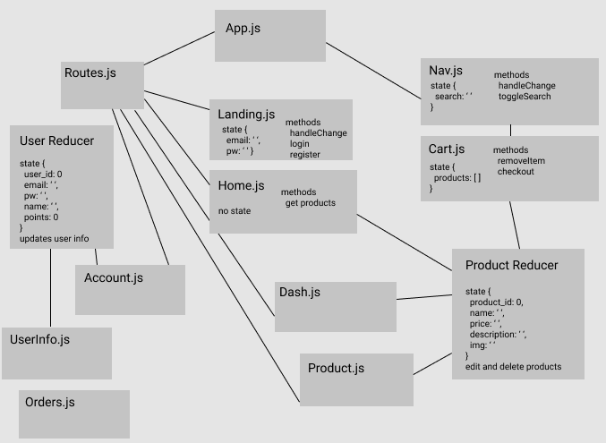

## Idea and Users
<ul>
  <li>This app will be an e-commerce site for environmentally sustainable household products</li>
  <li>Target user is people who want to reduce their ecological footprint</li>
  <li>Users can create an account
    <ul>
      <li>They can update user information</li>
      <li>They can buy products</li>
      <li>They can set up recurring purchases***</li>
      <li>User can get points that build up over time for discounts***</li>
    </ul>
  </li>
  <li>Sellers will be able to add their products that they would like to sell ***
    <ul>
      <li>They will be able to update their business's info***</li>
      <li>Ability to add, edit, and delete products***</li>
    </ul>
  </li>
</ul>

## Features
**MVP**
<ul>
  <li>register/login</li>
  <li>edit user info</li>
  <li>buy product</li>
  <li>clear cart</li>
</ul>

**icebox**
<ul>
  <li>set up subscriptions for goods</li>
  <li>donate to non-profits</li>
  <li>point system for buying products</li>
  <li>Sellers can create a seller account and post, edit, and delete their products for sale.</li>
</ul>

## Database
User
```SQL
create table users (
  user_id serial primary key,
  email varchar(100),
  password text,
  name varChar(25),
  points int,
);
```

Product
```SQL
create table products (
  product_id serial primary key,
  name varchar (300),
  price int,
  img varchar(3000),
  description text
);
```

Product Photos
```SQL
create table photos (
  photo_id serial primary key,
  product_id int references products(product_id),
  extra_img varchar(3000)
);
```

Cart
```SQL
select u.user_id, p.product_id
into cart from users u
join products p on u.user_id = p.product_id;
```

## View









## Server
**dependencies**
<ul>
    <li>express</li>
    <li>express-session</li>
    <li>massive</li>
    <li>dotenv</li>
    <li>bcrypt</li>
</ul>

**endpoints**
- auth:
  - app.post('/auth/register')
  - app.post('/auth/login)
  - app.put('/auth/edit/:user_id)
  - app.delete('/auth/logout)

- product:
  - app.get('/api/products')
  - app.post('/api/product')
  - app.put('/api/product/:product_id')
  - app.delete('/api/product/:product_id')

- cart:
  - app.get('/api/users/:user_id/cart')
  - app.put('/api/users/:user_id/cart')
  - app.delete('/api/users/:user_id/cart')

**controllers**
```
POST 'auth/register'
  Recieve: req.body {
    email: 'a@gmail.com',
    pw: 'pw'
  }
  Send: {
    user_id: 0
    email: 'a@gmail.com',
    name: null,
    points: 0
  }


Post '/auth/login'
  Recieve: req.body {
    email: 'a@gmail.com',
    pw: 'pw'
  }
  Send: {
    user_id: 0
    email: 'a@gmail.com',
    name: 'Andy',
    points: 0
  }

Put '/auth/user/:user_id'
  Recieve: req.params.user_id 0
    req.query {
      email: 'b@gmail.com',
      name: 'Brad',
    }
    Send: {
      user_id: 0,
      email: email,
      name: name,
      points: 0
    }

Delete '/auth/logout'
  req.session.destroy()
  res.sendStatus(200)

Get 'api/products'
  Send: [{
    product_id: 0
    name: 'bidet',
    price: 50,
    description: 'save the world from toilet paper',
    img: 'img_url'
  }]
```

## Client
**dependencies**
<ul>
    <li>axios</li>
    <li>react-router-dom</li>
    <li>redux</li>
    <li>react-redux</li>
    <li>redux-promise-middleware</li>
</ul>

**routes**
- Home (/)
- landing (/login)
- UserInfo (/user)
- Cart (/cart)
- Dashboard (/dash)

**extra routes**
- Account (/account)
- ProductPage (/product)
- Subscription (/subscription)
- Orders (/orders)

**file structure**
- src/
    - App.js /.css
    - index.js
    - redux/
        - store.js
        - userReducer.js
        - productReducer.js
    - components/
        - Landing.js /.css
        - Home.js /.css
        - Nav.js /.css
        - User/
          - Account.js /.css
          - UserInfo.js /.css
          - Orders.js /.css
          - Subscription.js /.css
          - Cart.js /.css
        - Dash.js /.css
        - Product.js /.css
        - ProductPage.js /.css


## Points

**core = 40**

- 3 pages with responsive views on 2 screen sizes; Home, dashboard , and Cart  = 10
- UserReducer = 10
- Use hooks on 5 components (App, Landing, Dash, applianceDash, householdDash) = 10
- authentication in Landing.js = 10


**hosting = 10**

- hosted @ http://167.172.199.70:3278/  = 10


**additional technology = 10**

- Stripe = 10


**presentation = 10**

- purpose: To provide people with a simple store where they can purchase household goods that are more environmentally sustainable.
- MVP: register/login, edit user info, buy product, clear cart
- Review Stripe
- Don't talk about what I haven't finished on it
- Shoot for 3 minute Presentation
        
## Minimum total = 70
        
